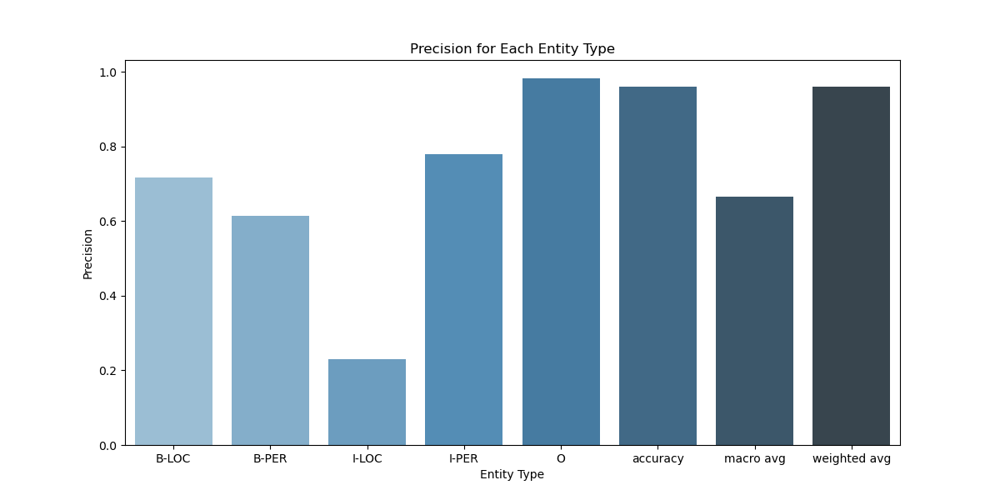
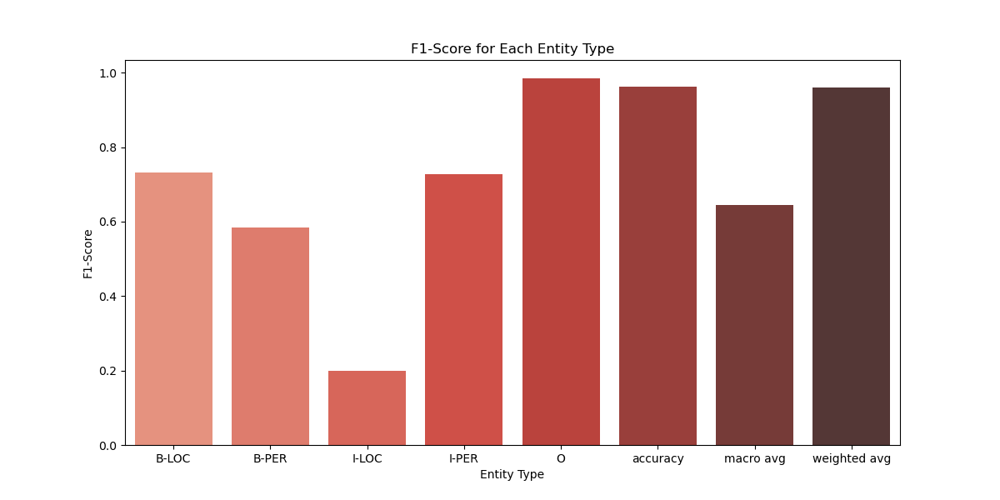
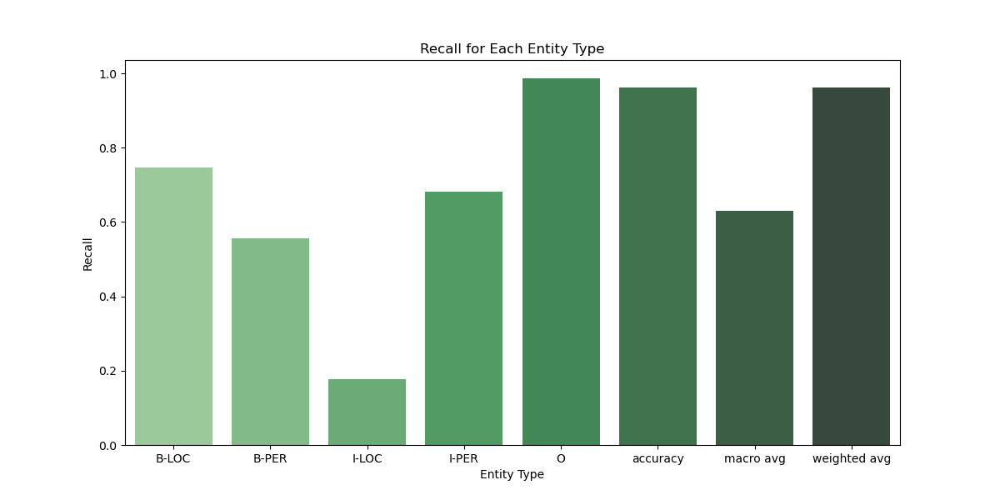
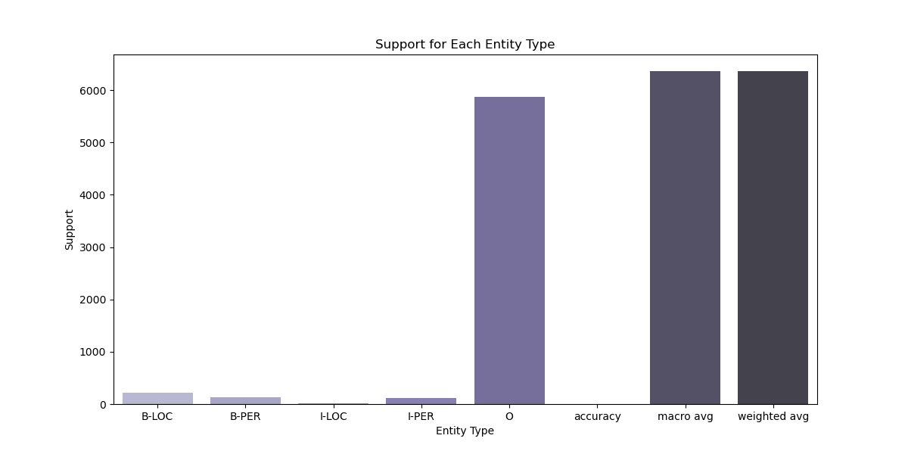

# Project Report: Ottoman Turkish Named Entity Recognition (NER) System

## Introduction

Named Entity Recognition (NER) is a crucial component of Natural Language Processing (NLP) systems, aiming to identify and classify entities such as persons, locations, and organizations in text. This project focuses on building an NER system for raw texts from judicial Ruznamçe registers.

## Data Preparation

### Training Data

Each word in the sentences is followed by a '/' and its corresponding label. The labels used are 'PERSON' and 'LOCATION'.

### Test Data

The test data consists of a small, annotated subset of judicial Ruznamçe registers, with the same entity types as the training data. This data is used to evaluate the model's performance.

## Methodology

### Data Parsing

The `train_ner.py` script includes a function `parse_ner_data_from_docx` that reads the DOCX file containing the training data. It extracts sentences and their corresponding named entity annotations. Each word and its label are split by the '/' delimiter.

### Model Training

A blank spaCy model is initialized, and a new NER pipeline is added. The NER pipeline is trained using the extracted sentences and annotations. The training process iterates 30 times optionally, updating the model's weights and saving the model at regular intervals. The model finds global minimum approximately after 40th iteration.

## Evaluation

The evaluate_ner.py script reads the test data and aligns the true and predicted entities with tokens. The evaluation metrics (precision, recall, and F1-score) are calculated using the classification_report function from sklearn. The results are saved to a CSV file and printed in the console.

### Visualization

The visualize_performance.py script reads the evaluation metrics from the CSV file and generates bar plots for precision, recall, F1-score, and support for each entity type. This visualization helps in understanding the model’s performance across different entity types.

### Results 

The model’s performance metrics are as follows:

	•	B-LOC: Precision 71.67%, Recall 74.55%, F1-Score 73.09%
	•	B-PER: Precision 61.40%, Recall 55.56%, F1-Score 58.33%
	•	I-LOC: Precision 23.08%, Recall 17.65%, F1-Score 20.00%
	•	I-PER: Precision 77.88%, Recall 68.07%, F1-Score 72.65%
	•	O (non-defined-entity): Precision 98.29%, Recall 98.66%, F1-Score 98.47%
	•	Overall accuracy: 96.16%

### Possible Implementations

This project demonstrates the development of an NER system for Ottoman Turkish using annotated data from historical texts. The model shows promising results, particularly for recognizing entity boundaries (B-LOC, B-PER), with room for improvement in recognizing internal parts of entities (I-LOC, I-PER). Further enhancements can include data augmentation, hyperparameter tuning, and the use of pretrained transformer models. Previously I tried using modular approach but raised dependency problem by torch. Please see ./model/data_prep.py 

## References

- spaCy Documentation: https://spacy.io/usage
- scikit-learn Documentation: https://scikit-learn.org/stable/
- NER system for Turkish language: https://github.com/snnclsr/ner
- Turkish NER model with spaCy: https://medium.com/@metehansaribas001/training-a-turkish-ner-model-with-spacy-library-using-transformers-architecture-a-step-by-step-702bb57b0985

## License

This project is licensed under the MIT License open-access.