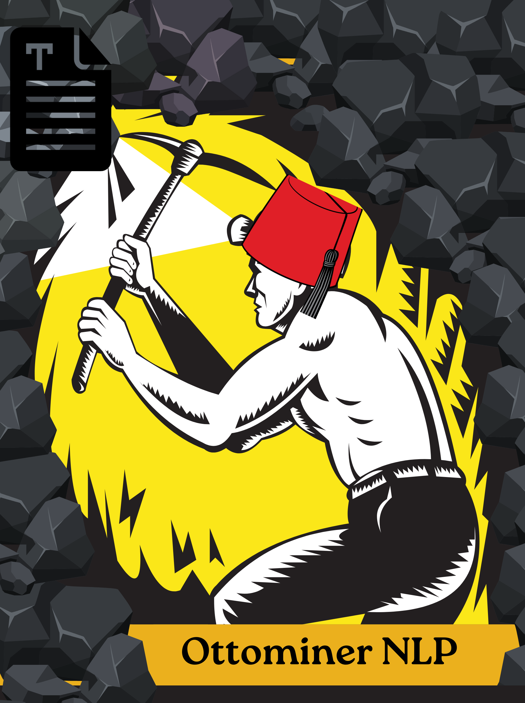

# Ottoman NER




---

## Project Background & Acknowledgments

This project is the result of an intensive year-long effort (2023–2024) to build and extend the foundational infrastructure for **Named Entity Recognition (NER)** in **Ottoman Turkish**, a historically rich yet computationally underrepresented variant of the Turkish language.

While parts of this work build on previously published resources under the [BUColin Lab](https://huggingface.co/bucolin) and related publications ([Karagöz et al., 2024](https://aclanthology.org/2024.sigturk-1.6.pdf), [Özateş et al., 2024](https://arxiv.org/pdf/2501.04828)), a significant portion of the data gathering, entropy analysis, corpus curation, OCR normalization, diacritic restoration, and experimental NER pipeline construction reflected in this repository was conducted independently during the 2023–2024 academic year.

> **This was never a “quick patch” project — it was a language engineering journey.**

### 🙏 Special Thanks

I would like to express my sincere gratitude to  
**Assoc. Prof. Şaziye Betül Özateş** and the **Boğaziçi University Computational Linguistics Lab (BUColin)**  
for their academic mentorship and foundational contributions to historical Turkish NLP.


The vision of this project is to support future Ottoman Turkish NLP research not just with models,  
but with **interpretable, extensible, and historically grounded resources** that bridge language, time, and region.

### References

- **BUColin Lab on Hugging Face**: [https://huggingface.co/bucolin](https://huggingface.co/bucolin)  
- **Ottoman NLP Group Repository**: [https://github.com/Ottoman-NLP](https://github.com/Ottoman-NLP)  
- **Karagöz et al. (2024)** — *“Towards a Clean Text Corpus for Ottoman Turkish”*  
  [ACL Anthology](https://aclanthology.org/2024.sigturk-1.6.pdf)  
- **Özateş et al. (2025)** — *“Building Foundations for Natural Language Processing of Historical Turkish: Resources and Models”*  
  [arXiv:2501.04828](https://arxiv.org/pdf/2501.04828)

---

## Features

- **Simple Interface**: Single class for all NER operations
- **Pre-trained Models**: Ready-to-use models for Ottoman Turkish
- **Easy Training**: Train custom models with JSON configuration
- **Built-in Evaluation**: Comprehensive evaluation metrics
- **Fast Prediction**: Real-time entity recognition

## Installation

```bash
# Install from source
git clone https://github.com/fatihburakkarag/ottoman-ner.git
cd ottoman-ner
pip install -e .

# Install with full features (optional)
pip install -e .[full]
```

## Quick Start

### 1. Load and Use a Pre-trained Model

```python
from ottoman_ner import OttomanNER

# Initialize
ner = OttomanNER()

# Load a trained model
ner.load_model("models_hub/ner/ottoman-ner-standard")

# Make predictions
text = "Sultan Abdülhamid İstanbul'da yaşıyordu."
entities = ner.predict(text)

print(entities)
# [{'text': 'Sultan Abdülhamid', 'label': 'PER', 'start': 0, 'end': 16, 'confidence': 0.99}]
```

### 2. Train a Custom Model

```python
from ottoman_ner import OttomanNER

# Initialize
ner = OttomanNER()

# Train from configuration
results = ner.train_from_config("configs/training.json")
```

### 3. Evaluate a Model

```python
from ottoman_ner import OttomanNER

# Initialize
ner = OttomanNER()

# Evaluate
results = ner.evaluate(
    model_path="models_hub/ner/ottoman-ner-standard",
    test_file="data/test.txt"
)

print(f"F1 Score: {results['overall_f1']:.4f}")
```

## Command Line Interface

### Train a Model

```bash
ottoman-ner train --config configs/training.json
```

### Evaluate a Model

```bash
ottoman-ner eval --model-path models/my-model --test-file data/test.txt
```

### Make Predictions

```bash
# Single text
ottoman-ner predict --model-path models/my-model --text "Sultan Abdülhamid"

# From file
ottoman-ner predict --model-path models/my-model --input-file input.txt --output-file predictions.json
```

## Configuration

Create a simple JSON configuration file for training:

```json
{
  "experiment": {
    "experiment_name": "my-ottoman-ner"
  },
  "model": {
    "model_name_or_path": "dbmdz/bert-base-turkish-cased",
    "num_labels": 9
  },
  "data": {
    "train_file": "data/train.txt",
    "dev_file": "data/dev.txt",
    "test_file": "data/test.txt",
    "max_length": 512
  },
  "training": {
    "output_dir": "models/my-model",
    "num_train_epochs": 3,
    "per_device_train_batch_size": 4,
    "learning_rate": 2e-5
  }
}
```

## Data Format

The toolkit expects CoNLL format data:

```
Sultan B-PER
Abdülhamid I-PER
İstanbul B-LOC
'da O
yaşıyordu O
. O
```

## Supported Entity Types

- **PER**: Person names
- **LOC**: Locations
- **ORG**: Organizations
- **MISC**: Miscellaneous entities

## Requirements

- Python 3.8+
- PyTorch 1.9+
- Transformers 4.20+
- See `requirements.txt` for full dependencies

## License

MIT License - see [LICENSE](LICENSE) file for details.

## Contributing

1. Fork the repository
2. Create a feature branch
3. Make your changes
4. Add tests if needed
5. Submit a pull request

## Citation

If you use this toolkit in your research, please cite:

```bibtex
@software{ottoman_ner_2024,
  title={Ottoman NER: A Toolkit for Ottoman Turkish Named Entity Recognition},
  author={Karagöz, Fatih Burak},
  year={2024},
  url={https://github.com/fbkaragoz/ottoman-ner}
}
```
---

## Author Note (TR)

> 2023–2025 akademik yılı boyunca bu proje üzerinde bireysel olarak çalıştım.  
> Geniş ölçekli ve tarihsel olarak çeşitlendirilmiş bir Osmanlı Türkçesi veri setini manuel olarak derledim, hizaladım, temizledim ve çeşitli biçimlerde etiketledim.  
> Özellikle OCR sonrası oluşan bozulmaları karakter düzeyinde normalize etmek, eksik harfleri ve diakritik işaretleri geri kazandırmak için çeşitli veri eşleştirme ve analiz yöntemleri geliştirdim.  
> Bunun yanı sıra, Osmanlıca metinlerin tarihsel evrimini daha iyi anlamak için **token-level entropi analizi** uygulayarak Tanzimat öncesi ve sonrası dilsel karmaşıklık farklılıklarını ortaya koymaya çalıştım.  
>  
> Ancak bu süreçte, bireysel olarak üstlendiğim bazı denemeler, özellikle yerel olarak geliştirdiğim çeşitli pipeline’lar ve modelleme girişimleri, hem kişisel sebeplerden hem de erken dönem amatörlüklerimden ötürü sistematik ve açık kaynaklı hale getirilemedi.  
> Yine de bu süreç, hem teknik hem de entelektüel olarak gelişimimde çok önemli bir yer tuttu.  
>  
> Bu projeyi ilk tasarladığım dönemin ardından bir süreliğine doğal dil işleme çalışmalarına ara verdim. Ancak bu aradan sonra, **hocam Şaziye Betül Özateş’in ilham verici rehberliği** ve kendi içsel motivasyonum sayesinde, projeye yeniden dönüş yaptım.  
>  
> Sayın Özateş’in desteği, benim kişisel araştırmacı yolculuğumda sadece akademik değil, insani olarak da çok özel bir yer tutmaktadır.  
> Kendisine ve **Boğaziçi Üniversitesi BUColin laboratuvarı** ekibine, hem önceki yayınlar hem de genel bilimsel katkıları nedeniyle içtenlikle teşekkür ederim.  
>  
> Bu proje yalnızca teknik bir araç değil; aynı zamanda **geçmişin dijital belleği**,  
> ve **gelecekte Osmanlı Türkçesi üzerine yapılacak dil teknolojileri çalışmalarının altyapısıdır.**
